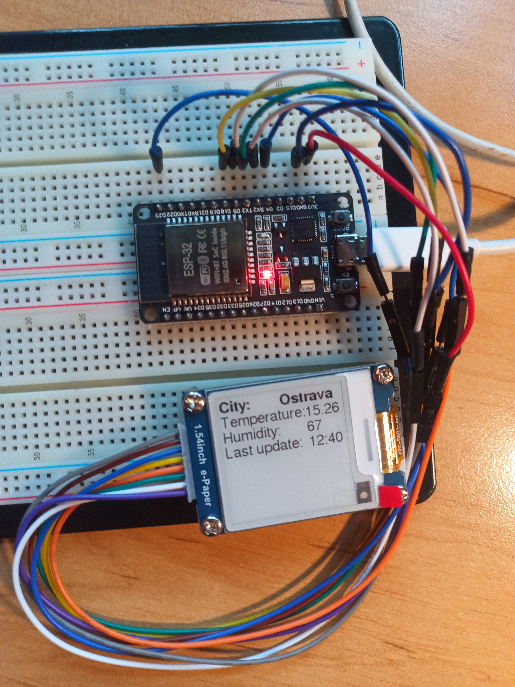

# ESP32 weather widget

ESP32 based project using E-ink display controlled by GxEPD2 library to show fetched weather data from OpenWeather API.

## Features
The application displays name of the location specified by coordinates, local temperature, humidity and time of the last update. The ESP32 is set to deep sleep, interrupted every 15 minutes only to fetch and display new data. If the ESP32 is unable to connect to WiFi, it will stop attempting after 5 seconds and display error message.

## Hardware
- ESP32 DOIT DEVKIT V1
- Waveshare 1.54 (200x200) e-Paper Module
- Jumper wires

### SPI pinout:
- Busy - pin 4
- Rst - pin 16
- DC - pin 17
- CS - pin 5
- Clk - pin 18

## Software
- VS Code with PlatformIO (core v. 6.1.19)
- GxEPD2
- ArduinoJson
- HTTPClient

If using Arduino IDE, refer to migration guides.

## Setup
1. Clone repo
2. Copy config_example.h to config.h
3. Fill in config.h with your data (get OpenWeather API key at https://openweathermap.org/)
4. If using different ESP32 board, change SPI pinout in main.cpp, 12 and pinout above
5. Connect ESP32 and upload

## Notes
- units aren't displayed on screen to save space
- units can be changed (default is °C), OpenWeather data is sent in Kelvin, which can be calculated to °F if desired, see main.cpp, 67
- housing for the display and ESP32 could be constructed, but my goal with this project was mainly learning to code, not to harware design